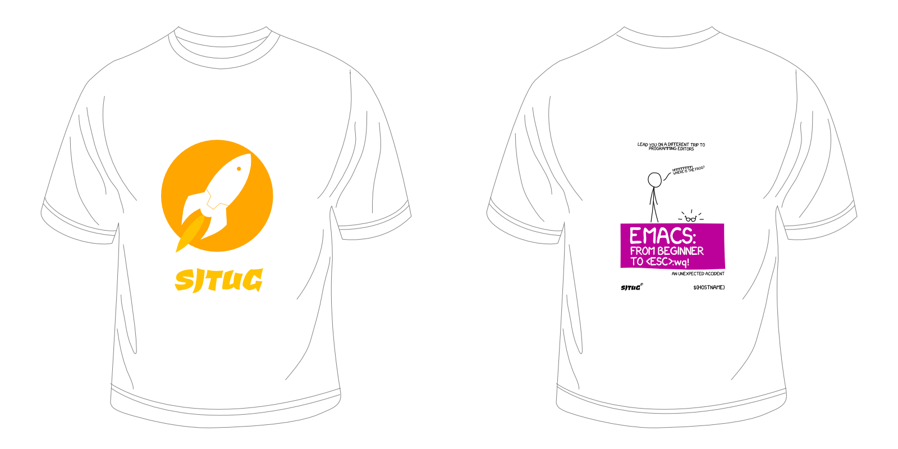
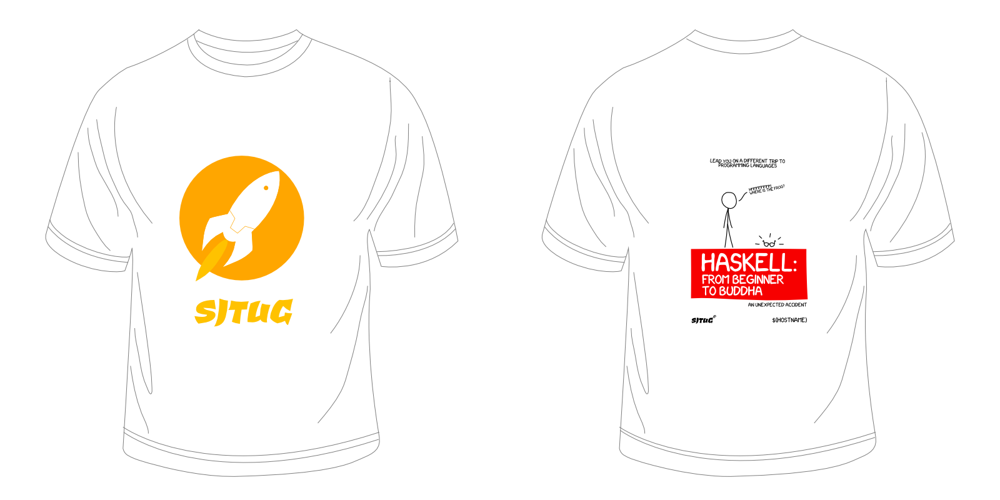

# Tee
Tee for SJTUG.

# Demo

# Instructions

To customize your own parttern:

1. Fork this repo
2. Find source file at [svg](./svg/) for Scalable Vector Graphics
3. Download and install the fancy font used from [xkcd-font](https://github.com/ipython/xkcd-font)
4. Modify the artworks and get your own design

# License

 SJTUG-Tee by <a xmlns:cc="http://creativecommons.org/ns#" href="http://sjtug.org" property="cc:attributionName" rel="cc:attributionURL">SJTUG</a> is licensed under a <a rel="license" href="http://creativecommons.org/licenses/by-nc-sa/4.0/">Creative Commons Attribution-NonCommercial-ShareAlike 4.0 International License</a>.
